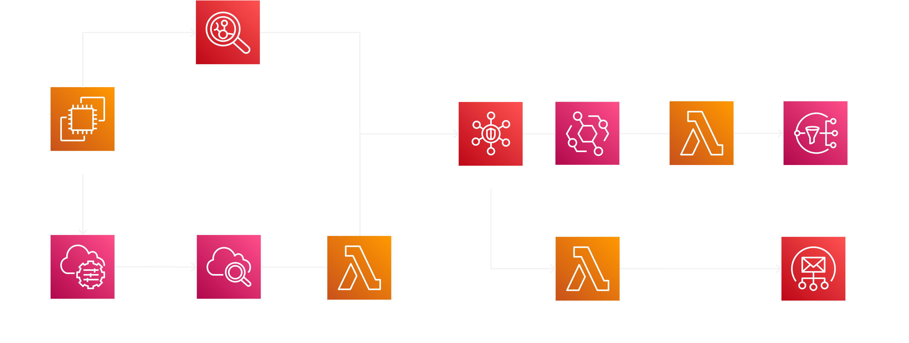
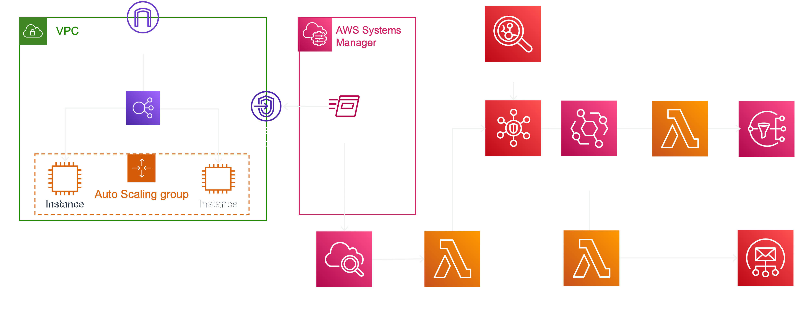
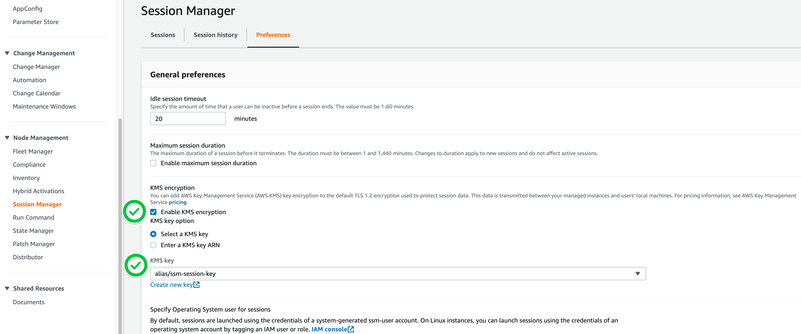
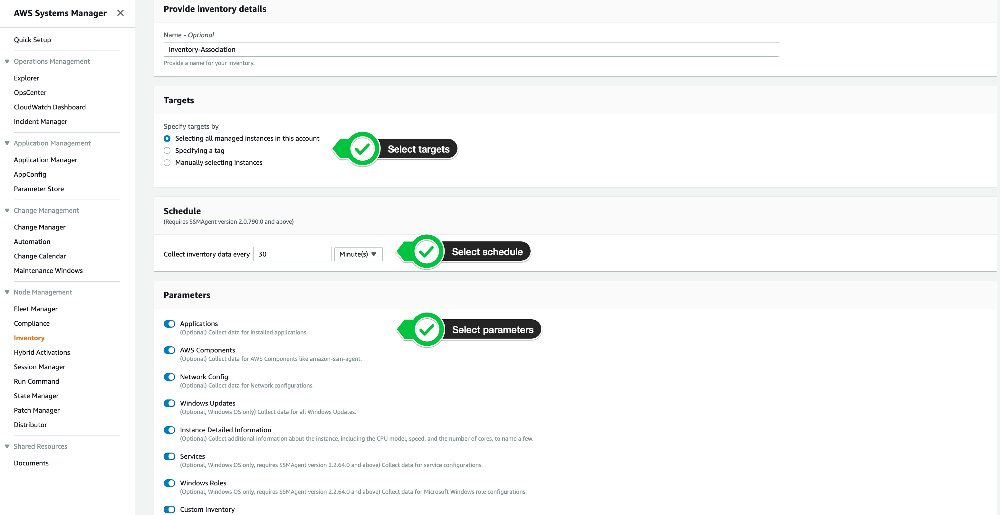
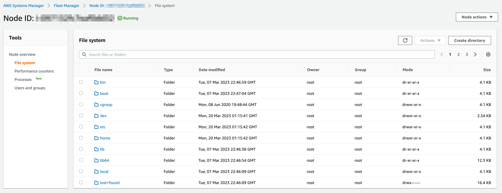
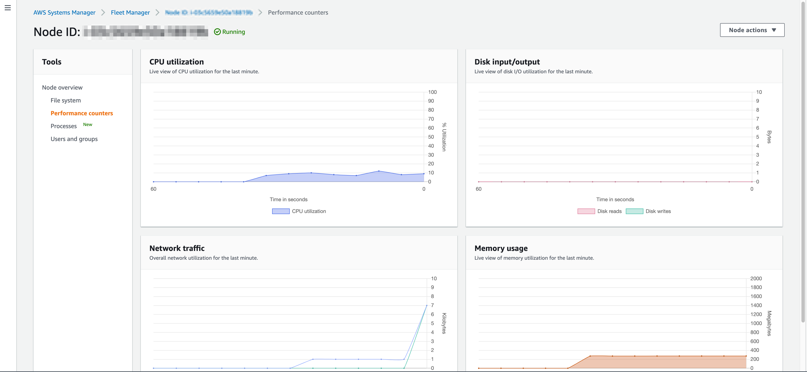
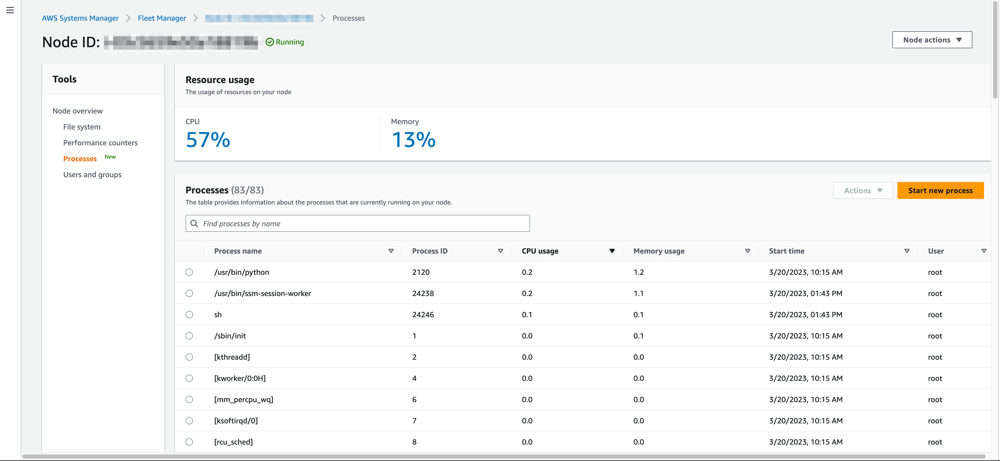
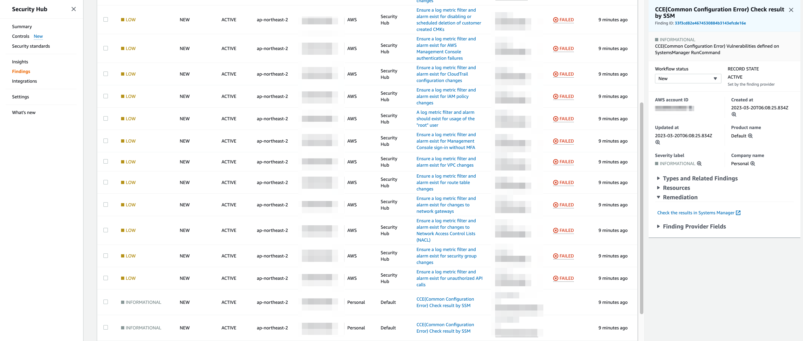
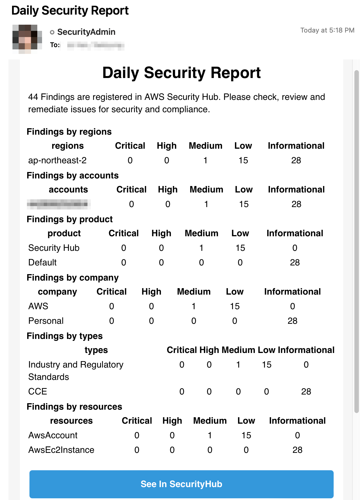

## What is Inventory Management for EC2?

Amazon Elastic Compute Cloud (EC2) is a popular cloud computing service offered by Amazon Web Services (AWS) that allows
users to rent virtual machines (VMs) in the cloud.

Managing inventory for Amazon EC2 involves tracking the various components that make up EC2 instances, including the VMs
themselves, the storage volumes, and the networking components.

## Introduction

This demo will cover EC2 instance management with AWS Services.It will be helpful for DevSecOps and Security Engineers
who want check OS Level system metric, CCE, and CVEs automatically.

This Demo is based on `ap-northeast-2` (Seoul region).

> CCE(Common Configuration Enumeration): Vulnerabilities in system settings that allow operations beyond the user's
> permitted privileges or enable information viewing, falsification, or leakage beyond the scope.
>
> CVE(Common Vulnerabilty and Exposures): publicly know information security vulerabilities and exposures.


### Demo Architecture Overview



### AWS Services

**Inventory management**

- Amazon EC2
- AWS Resource Groups & Tag Editor
- AWS Resource Explorer

**Inspect and track EC2 vulnerabilty**

- AWS Systems Manager
- Amazon Inspector

**Monitoring Services and Notification**

- Amazon SecurityHub
- Amazon SNS
- Amazon SES (Simple Email Services)

## Quick Start

### 0. Requirements

- AWS Account - [Craete AWS Account](https://aws.amazon.com/ko/resources/create-account/)
- AWS CDK (python) - [CDK Install Guide](https://docs.aws.amazon.com/cdk/v2/guide/work-with-cdk-python.html)
- AWS CLI - [AWS CLI Install Guide](https://docs.aws.amazon.com/cli/latest/userguide/getting-started-install.html)
- Email for Notification

### 1. Setup CDK

```bash
git clone https://github.com/aws-samples/inventory-management-for-amazon-ec2.git
cd images-for-amazon-ec2
cdk bootstrap
```


### 2. DemoVPCStack


#### 2-a. Deploy DemoVPCStack

```bash
cdk deploy DemoVPCStack
```

### 3. InventoryManagementStack


#### 3-a. Deploy InventoryManagementStack

```bash
cdk deploy InventoryManagementStack --parameters TargetEmail=YOUR_EMAIL@DOMAIN.COM
```

#### 2-b. Enable Inspector

```bash
aws inspector2 enable --resource-types EC2
```

### 4. SecurityReportStack

#### 4-a. Deploy SecurityReportStack

```bash
cdk deploy SecurityReportStack --parameters TargetEmail=YOUR_EMAIL@DOMAIN.COM
```



## Hands On Lab: Inventory Management

### 1. Manage Inventory

1. After deploy DemoVPCStack, `ssm-session-key` KSM Key is created.
2. `Enable KMS encryption` by KMS key (alias: ssm-session-key)
3. Monitor EC2 Instance OS Level metric and system

#### 1-a. Systems Manager > Session Manager > Preferences

To collect more detailed system level metrics(system performance, CPU, Memory, access session), KSM encryption is
required for session manager.

Go
to [Session Manager Preferences](https://ap-northeast-2.console.aws.amazon.com/systems-manager/session-manager/preferences)



#### 1-b. Systems Manager > Inventory Manager > Setup Inventory

Go to [Systems Manager Inventory](https://ap-northeast-2.console.aws.amazon.com/systems-manager/inventory)



#### 1-c. Systems Manager > Fleet Manager

Go to [Systems Manager Fleet Manager](https://ap-northeast-2.console.aws.amazon.com/systems-manager/managed-instances)








### 2. Check CCE for EC2 Instances

#### 2-a. Confirm Subscribe for SNS Notification


#### 2-b. Create Resource Groups

1. Go to [Resource Groups Console](https://ap-northeast-2.console.aws.amazon.com/resource-groups/groups/new)
    1. Select Resource Type: `AWS::EC2::instance`
    2. Select Tags: `Env: Dev`, `InventoryCategory: WAS`
    3. Group Name: `DEVWasInstance`

#### 2-c. Run CCE Check commands via Systems Manager without SSH

```bash
bash scripts/check_cce_param_by_resource_group.sh DevWASInstances
```

**Outputs**

```
{
    "Command": {
        "CommandId": "a48b66f4-ecab-4074-ad1c-5e9236afcb09",
        "DocumentName": "AWS-RunShellScript",
        "DocumentVersion": "1",
        "Comment": "",
        "ExpiresAfter": "2023-03-20T15:41:19.972000+09:00",
        "Parameters": {
            "commands": [
                "#!/bin/bash",
                "echo \"U-04. Check Password Max Days\"",
                "cat /etc/login.defs | grep PASS_MAX_DAYS",
                "echo \n\"U-06 (High): Check Home Env Path setting\"",
                "echo $PATH",
                "echo \n\"U-08 (High): Check /etc/passwd file owner and permission\"",
                "ls -l /etc/passwd",
                "echo \n\"U-09 (High): Check /etc/shadow file owner and permission\"",
                "ls -l /etc/passwd",
                "echo \n\"U-10 (High): Check /etc/hosts file owner and permission\"",
                "ls -l /etc/hosts",
                "echo \n\"U-15 (High): Check User, system init and env owner and permission\"",
                "cat /etc/passwd | grep /home"
            ],
            "executionTimeout": [
                "3600"
            ],
            "workingDirectory": [
                ""
            ]
        },
        "InstanceIds": [],
        "Targets": [
            {
                "Key": "resource-groups:Name",
                "Values": [
                    "DevWASInstances"
                ]
            }
        ],
        "RequestedDateTime": "2023-03-20T14:31:19.972000+09:00",
        "Status": "Pending",
        "StatusDetails": "Pending",
...
```


**How it works?**

1. After run CCE Check commands, you can get the detailed result in Systems Manager Run Command.
2. And The result is delivered to AWS Security Hub as findings via AWS CloudWatch and AWS Lambda.
3. Events for Registered Custom findings in AWS Security Hub will trigger Lambda(NotifyCCEFindings)
4. Notify CCE Findings Lambda send CCE check results via Amazon SNS(Simple Notification Service).

### 3. Monitoring and Notification

#### 3-a. Security Hub Dashboard

Go to [Security Hub Console](https://ap-northeast-2.console.aws.amazon.com/securityhub/home#/summary)



#### 3-b. Setup Email Report Notification


#### 3-c. Daily Security Report

After verify your email for SES, you can get daily security report for previous day at scheduled time.

If you want to get Daily Security Report for today now, run below script that invoke lambda with payload. In few
minutes, you can get the report.

```bash
bash scripts/send_today_report.sh
```



## Security

See [CONTRIBUTING](CONTRIBUTING.md#security-issue-notifications) for more information.

## License

This library is licensed under the MIT-0 License. See the LICENSE file.